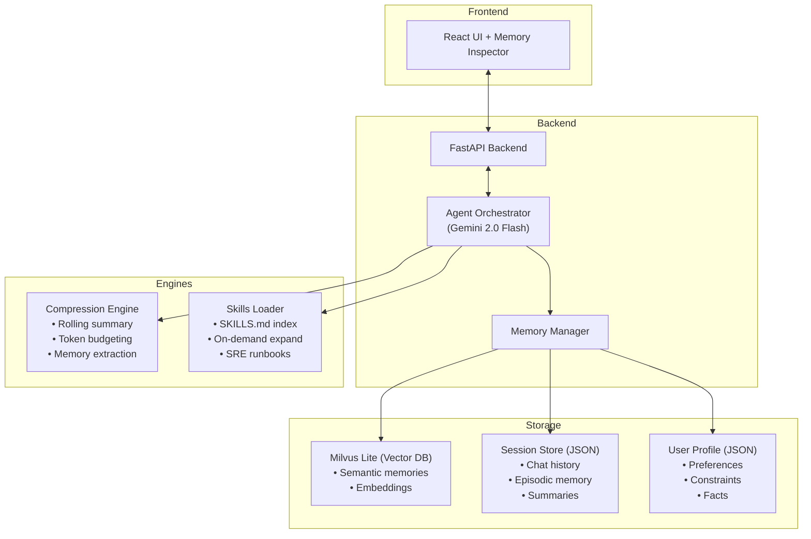

# OpsAgent — Agentic Memory Demo

An end-to-end AI SRE assistant that demonstrates every layer of an agent memory system:
**vector retrieval → context compression → cross-session persistence → progressive disclosure**.

```
┌─────────────────────────────────────────────────────────────────────────┐
│                          OPSAGENT ARCHITECTURE                          │
│                                                                         │
│  ┌──────────┐     ┌───────────┐     ┌─────────────────────────────┐    │
│  │  React UI │────▶│  FastAPI   │────▶│   Agent Orchestrator        │    │
│  │  + Memory │◀────│  Backend   │◀────│   (Gemini 2.0 Flash)        │    │
│  │  Inspector│     └───────────┘     └──────────┬──────────────────┘    │
│  └──────────┘                                   │                       │
│                                    ┌────────────┴────────────┐          │
│                                    │     Memory Manager       │          │
│                                    └────────────┬────────────┘          │
│                          ┌──────────────────────┼──────────────┐        │
│                          │                      │              │        │
│                   ┌──────▼──────┐  ┌────────────▼──┐  ┌───────▼─────┐  │
│                   │  Milvus Lite │  │ Session Store  │  │ User Profile│  │
│                   │  (Vector DB) │  │  (JSON files)  │  │ (JSON file) │  │
│                   │              │  │                │  │             │  │
│                   │ • Semantic   │  │ • Chat history │  │ • Prefs     │  │
│                   │   memories   │  │ • Episodic mem │  │ • Constr.   │  │
│                   │ • Embeddings │  │ • Summaries    │  │ • Facts     │  │
│                   └──────────────┘  └────────────────┘  └─────────────┘  │
│                                                                         │
│                   ┌───────────────────┐    ┌──────────────────────┐      │
│                   │ Compression Engine │    │ Skills Loader        │      │
│                   │ • Rolling summary  │    │ • SKILLS.md index    │      │
│                   │ • Token budgeting  │    │ • On-demand expand   │      │
│                   │ • Memory extraction│    │ • SRE runbooks       │      │
│                   └───────────────────┘    └──────────────────────┘      │
└─────────────────────────────────────────────────────────────────────────┘
```



## What Each Step Demonstrates

| Blog Section | Demo Component | What You'll See |
|---|---|---|
| **Step 1 — Vector Store** | `memory/vector_store.py` | Milvus Lite schema, upsert pipeline, cosine search + recency reranking |
| **Step 2 — Compression** | `memory/compression.py` | Rolling summarization, token-budget pruning, memory extraction |
| **Step 3 — Cross-Session** | `memory/user_profile.py` + `session_store.py` | Profile persistence, "last time we…" episodic context |
| **Bonus — Progressive Disclosure** | `memory/skills.py` + `skills_registry/` | SKILLS.md index, keyword match, on-demand runbook loading |

## The Agent Loop

Every chat message flows through:

```
Read (store user msg)
  → Retrieve (vector search + profile + episodic context + skills)
    → Assemble (token-budget context packing)
      → Act (Gemini 2.0 Flash)
        → Write-back (extract memories → Milvus, update profile, rolling summary)
```

The **Memory Inspector** panel on the right side of the UI shows every step in real-time.

## SRE Scenario Walkthrough

Try these messages in order to see all memory features in action:

1. **Profile creation**: *"I'm an SRE at Acme Corp. We run K8s on AWS with Datadog for monitoring and Terraform for IaC."*
   → Watch the **User Profile** panel populate with preferences and facts.

2. **Incident triage** (skills loading): *"We're getting P1 alerts — payment-service is throwing OOM errors in production."*
   → Watch the **Skills** panel load the `incident_triage` runbook. Check **Retrieved Memories** for your infra context.

3. **Rollback help**: *"How do I rollback the last Helm release for checkout-service?"*
   → Watch `rollback` skill expand while `incident_triage` stays idle.

4. **Start a new session** (cross-session persistence): Click "New Session", then ask: *"What was I working on?"*
   → Watch the **Episodic Context** panel inject the previous session's summary.

5. **Capacity planning**: *"What's the capacity planning formula for our order-service before Black Friday?"*
   → Watch `capacity_planning` skill load. Previous memories about your K8s/AWS stack should be retrieved.

6. **Long conversation** (compression): Keep chatting — after 6+ messages, the **Compression** panel will show a rolling summary being generated.

## Setup

### Prerequisites
- Python 3.11+
- Node.js 18+
- A [Google Gemini API key](https://aistudio.google.com/apikey)

### Backend

```bash
cd demo/backend
python -m venv .venv
source .venv/bin/activate
pip install -r requirements.txt

# Configure your API key
cp .env.example .env
# Edit .env and add your GEMINI_API_KEY

# Run the server
uvicorn main:app --reload --port 8000
```

### Frontend

```bash
cd demo/frontend
npm install
npm run dev
```

Open **http://localhost:5173** — the frontend proxies API calls to the backend on `:8000`.

## Tech Stack

| Component | Technology |
|---|---|
| LLM | Google Gemini 2.0 Flash |
| Vector DB | Milvus Lite (embedded, single-file) |
| Embeddings | all-MiniLM-L6-v2 (via pymilvus) |
| Backend | FastAPI (Python) |
| Frontend | React + Vite + Tailwind CSS |
| Persistence | JSON files (swap for Postgres/Redis in prod) |

## Project Structure

```
demo/
├── backend/
│   ├── main.py                  # FastAPI endpoints
│   ├── agent.py                 # Agent orchestrator (the brain)
│   ├── memory/
│   │   ├── vector_store.py      # Step 1: Milvus Lite integration
│   │   ├── compression.py       # Step 2: Rolling summaries + pruning
│   │   ├── user_profile.py      # Step 3: Cross-session profile
│   │   ├── session_store.py     # Step 3: Session persistence
│   │   └── skills.py            # Bonus: Progressive disclosure
│   ├── skills_registry/
│   │   ├── SKILLS.md            # Lightweight index (always loaded)
│   │   ├── incident_triage.md   # Full runbook (loaded on-demand)
│   │   ├── rollback.md          #   "
│   │   ├── capacity_planning.md #   "
│   │   └── monitoring_setup.md  #   "
│   ├── requirements.txt
│   └── .env.example
├── frontend/
│   └── src/
│       ├── App.jsx              # Main layout
│       └── components/
│           ├── ChatPanel.jsx    # Chat interface
│           ├── MemoryInspector.jsx  # Real-time memory debug panel
│           └── SessionSidebar.jsx   # Session list + new session
└── README.md
```
